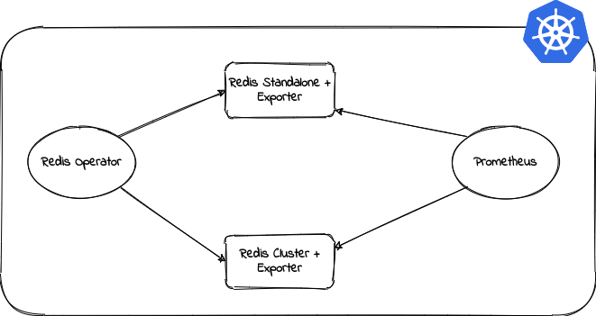

<p align="left">
  
</p>

# Speculator: Redis Operator

A golang based redis operator which will make/oversee Redis standalone/cluster mode setup on top of the Kubernetes.

### Purpose

The purpose of creating this operator was to provide an easy and production grade setup of Redis on Kubernetes. It doesn't care if you have a plan Kubernetes, a Cloud based.

### Supported Features

Here the features which are supported by this operator:-

- Redis cluster/standalone mode setup
- Inbuilt monitoring with prometheus exporter
- Dynamic storage provisioning with pvc template
- Resources restrictions with k8s requests and limits
- Password/Password-less setup
- Node selector and affinity
- Priority class to manage setup priority
- SecurityContext to manipulate kernel parameters

### Getting Started

<p align="center">
  
</p>

If you want to deploy redis-operator from scratch to a local Minikube cluster, begin with the [Getting started](./GETTING_STARTED.md) document. It will guide your through the setup step-by-step.

### Example

The configuration of Redis setup should be described in Redis CRD. You will find all the examples manifests in [example](./example) folder.

### Prerequisites

Redis operator requires a Kubernetes cluster of version `>=1.8.0`. If you have just started with Operators, its highly recommended to use latest version of Kubernetes.

### Quickstart

The setup can be done by using helm. If you want to see more example, please go through the [example](./example) folder.

But you can simply use the helm chart for installation.

```shell
# Deploy the redis-operator
helm upgrade redis-operator ./helm/redis-operator --install --namespace redis-operator
```

After deployment, verify the installation of operator

```shell
helm test redis-operator --namespace redis-operator
```

Creating redis cluster or standalone setup.

```shell
# Create redis cluster setup
helm upgrade redis-cluster ./helm/redis-setup --set redisSetup.setupMode="cluster" \
--set redisSetup.clusterSize=3 \
--install --namespace redis-operator
```

```shell
# Create redis standalone setup
helm upgrade redis ./helm/redis-setup --set redisSetup.setupMode="standalone" \
--install --namespace redis-operator
```

Other customizable values are present in [values.yaml](./helm/redis-setup/values.yaml) with description.

### Monitoring with Prometheus

To monitor redis performance we will be using prometheus. In any case, extra prometheus configuration will not be required because we will be using the Prometheus service discover pattern. For that we already have set these annotations:-

```yaml
  annotations:
    "redis.opstreelabs.in": "true"
    "prometheus.io/scrape": "true"
    "prometheus.io/port": "9121"
```

### Development

Please see our [DEVELOPMENT.md](./DEVELOPMENT.md) for details.

### Release History

Please see our [CHNANGELOG.md](./CHANGELOG.md) for details.

### Documentation

Please see our [GETTING_STARTED.md](./GETTING_STARTED.md) for details.

## To Do

- Dynamic Configuration Update
- Add unit test cases
- Add circle ci pipeline integration
- Logging needs to be structured
- Fix permissions in role and rolebindings
- Refactor code as much as we can
