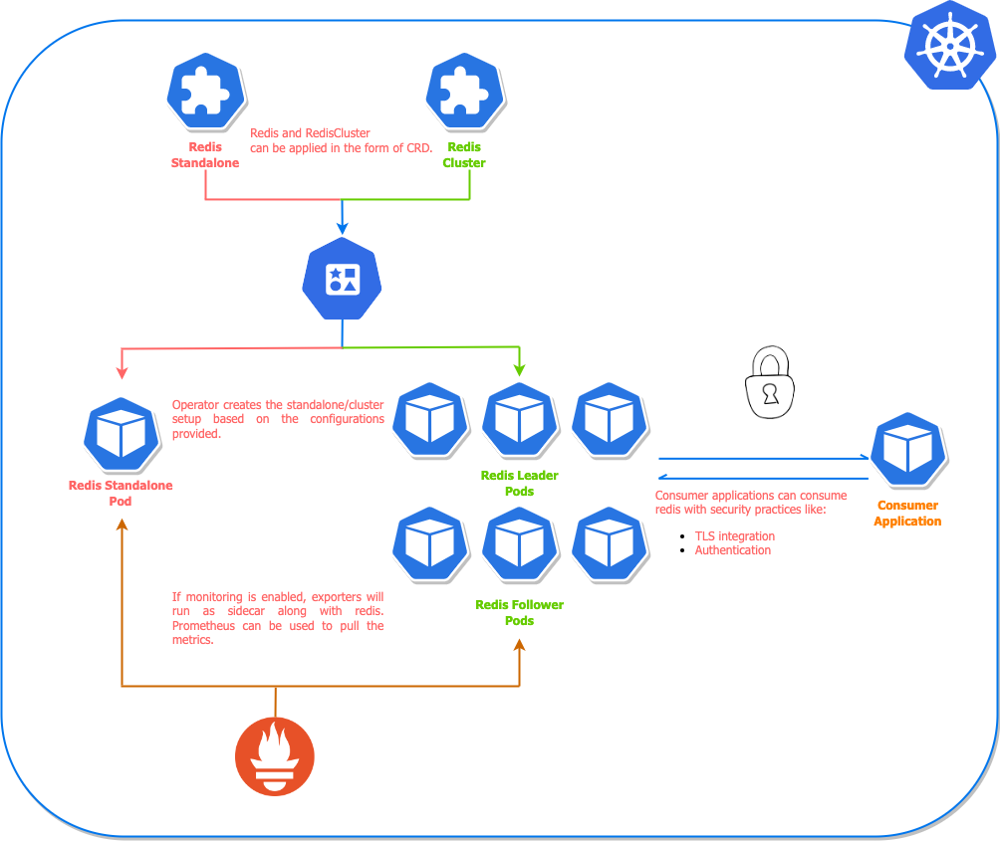

<p align="center">
  
</p>

<p align="center">
  <a href="https://dev.azure.com/opstreedevops/DevOps/_apis/build/status/redis-operator/redis-operator?repoName=OT-CONTAINER-KIT%2Fredis-operator&branchName=main">
    
  </a>
  <a href="https://goreportcard.com/report/github.com/OT-CONTAINER-KIT/redis-operator">
    
  </a>
  <a href="http://golang.org">
    
  </a>
  <a href="http://golang.org">
    
  </a>
  <a href="https://quay.io/repository/opstree/redis-operator">
    
  </a>
  <a href="https://github.com/OT-CONTAINER-KIT/redis-operator/main/LICENSE">
    
  </a>
</p>

A Golang based redis operator that will make/oversee Redis standalone and cluster mode setup on top of the Kubernetes. It can create a redis cluster setup with best practices on Cloud as well as the Bare metal environment. Also, it provides an in-built monitoring capability using redis-exporter.

For documentation, please refer to <https://ot-redis-operator.netlify.app/>

Organizations that are using Redis Operator to manage their redis workload can be found [here](./USED_BY_ORGANIZATIONS.md). If your organization is also using Redis Operator, please free to add by creating a [pull request](https://github.com/OT-CONTAINER-KIT/redis-operator/pulls)

This operator only supports versions of redis `=>6`.

## Architecture

<div align="center">
    
</div>

## Purpose

There are multiple problems that people face while setting up redis setup on Kubernetes, specially cluster type setup. The purpose of creating this opperator is to provide an easy and production ready interface for redis setup that include best-practices, security controls, monitoring, and management.

## Supported Features

Here the features which are supported by this operator:-

- Redis cluster and standalone mode setup
- Redis cluster failover and recovery
- Inbuilt monitoring with redis exporter
- Password and password-less setup of redis
- TLS support for additional security layer
- Ipv4 and Ipv6 support for redis setup
- Detailed monitoring grafana dashboard

## Getting Started

If you want to deploy redis-operator from scratch to a local Minikube cluster, begin with the [Getting started](https://ot-container-kit.github.io/redis-operator/#/quickstart/quickstart) document. It will guide your through the setup step-by-step.

The configuration of Redis setup should be described in [CRD definitions](config/crd/bases). All the examples related to redis standalone and cluster setup can be found inside [example](./example) folder.

## Prerequisites

Redis operator requires a Kubernetes cluster of version `>=1.18.0`. If you have just started with Operators, it's highly recommended using the latest version of Kubernetes.

## Image Compatibility

The following table shows the compatibility between the Operator Version, Redis Image, Sentinel Image, and Exporter Image:

| Operator Version | Redis Image | Sentinel Image | Exporter Image |
| ---------------- | ----------- | -------------- | -------------- |
| v0.19.x          | > v7.0.12, >=v6.2.14     | > v7.0.12, >= v6.2.14        | v1.44.0        |
| v0.18.x          | v7.0.12     | v7.0.12        | v1.44.0        |
| v0.17.0          | v7.0.12     | v7.0.12        | v1.44.0        |
| v0.16.0          | v7.0.12     | v7.0.12        | v1.44.0        |
| v0.15.1          | v7.0.12     | v7.0.12        | v1.44.0        |
| v0.15.0          | v7.0.11     | v7.0.11        | v1.44.0        |
| v0.14.0          | v7.0.7      | v7.0.7         | v1.44.0        |
| v0.13.0          | v6.2.5      | nil            | v1.44.0        |

## Quickstart

The setup can be done by using helm. If you want to see more example, please go through the [example](./example) folder.

But you can simply use the helm chart for installation.

```shell
# Add the helm chart
$ helm repo add ot-helm https://ot-container-kit.github.io/helm-charts/
```

```shell
# Deploy the redis-operator
$ helm upgrade redis-operator ot-helm/redis-operator \
  --install --create-namespace --namespace ot-operators
```

After deployment, verify the installation of operator

```shell
helm test redis-operator --namespace ot-operators
```

Creating redis cluster, standalone, replication and sentinel setup.

```shell
# Create redis cluster setup
$ helm upgrade redis-cluster ot-helm/redis-cluster \
  --set redisCluster.clusterSize=3 --install \
  --namespace ot-operators
```

```shell
# Create redis standalone setup
$ helm upgrade redis ot-helm/redis \
  --install --namespace ot-operators
```

```shell
# Create redis replication setup
$ helm upgrade redis-replication ot-helm/replication \
  --install --namespace ot-operators
```

```shell
# Create redis sentinel setup
$ helm upgrade redis-sentinel ot-helm/sentinel \
  --install --namespace ot-operators
```

If you want to customize the value file by yourself while initializing the helm command, the values files for reference are present [here](https://github.com/OT-CONTAINER-KIT/helm-charts/tree/main/charts/redis-setup).

## Monitoring with Prometheus

To monitor redis performance we will be using prometheus. In any case, extra prometheus configuration will not be required because we will be using the Prometheus service discover pattern. For that we already have set these annotations:-

```yaml
  annotations:
    redis.opstreelabs.in: "true"
    prometheus.io/scrape: "true"
    prometheus.io/port: "9121"
```

## Contribution

Please see our [CONTRIBUTING.md](./CONTRIBUTING.md) for details.

## Release History

Please see our [CHANGELOG.md](./CHANGELOG.md) for details.

## Contact Information

This project is managed by [OpsTree Solutions](http://opstree.com). For any queries or suggestions, you can reach out to us at [opensource@opstree.com](mailto:opensource@opstree.com).

Join our Slack Channel: [#redis-operator](https://opstree.slack.com/archives/C05MBRB50JG).
