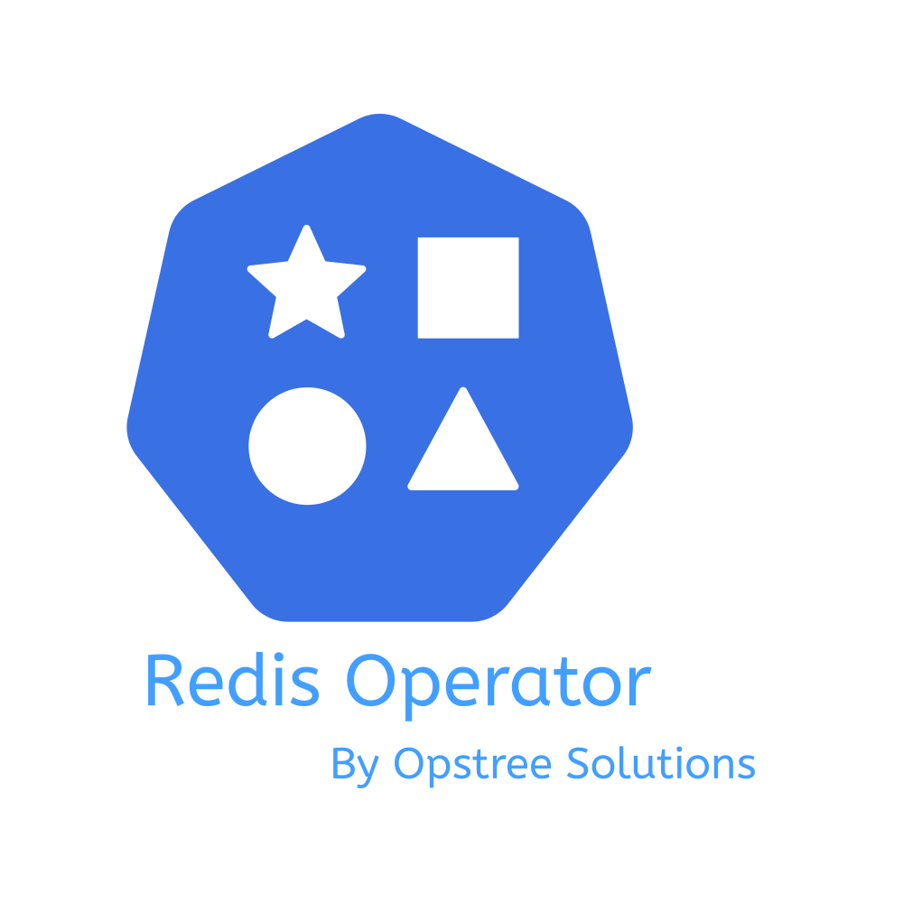

<p align="center">
  
</p>

<p align="center">
  <a href="https://github.com/OT-CONTAINER-KIT/redis-operator/actions/workflows/ci.yaml">
    
  </a>
  <a href="https://goreportcard.com/report/github.com/OT-CONTAINER-KIT/redis-operator">
    
  </a>
  <a href="http://golang.org">
    
  </a>
  <a href="http://golang.org">
    
  </a>
  <a href="https://quay.io/repository/opstree/redis-operator">
    
  </a>
  <a href="https://github.com/OT-CONTAINER-KIT/redis-operator/main/LICENSE">
    
  </a>
</p>

A Golang-based Redis operator that will make/oversee Redis standalone and cluster mode setup on top of Kubernetes. It can create a Redis cluster setup with best practices on Cloud as well as the bare metal environment. Also, it provides an in-built monitoring capability using redis-exporter.

For documentation, please refer to <https://redis-operator.opstree.dev/>

Organizations that are using Redis Operator to manage their Redis workload can be found [here](./USED_BY_ORGANIZATIONS.md). If your organization is also using Redis Operator, please feel free to add by creating a [pull request](https://github.com/OT-CONTAINER-KIT/redis-operator/pulls)

This operator only supports versions of Redis `>=6`.

## Architecture

<div align="center">
    
</div>

## Purpose

There are multiple problems that people face while setting up Redis setup on Kubernetes, especially cluster type setup. The purpose of creating this operator is to provide an easy and production-ready interface for Redis setup that includes best-practices, security controls, monitoring, and management.

## Supported Features

Here are the features which are supported by this operator:

- Redis cluster and standalone mode setup
- Redis cluster failover and recovery
- Inbuilt monitoring with redis exporter
- Password and password-less setup of Redis
- TLS support for additional security layer
- IPv4 and IPv6 support for Redis setup
- Detailed monitoring Grafana dashboard

## Prerequisites

Redis Operator requires a Kubernetes cluster of version `>=1.18.0`. If you have just started with Operators, it's highly recommended using the latest version of Kubernetes.

## Image Compatibility

The operator supports Redis versions `>=6.x`. However, **it is strongly recommended to use the latest stable version** to ensure you have the latest security fixes and bug patches from upstream.

**Container Images:**
- **Redis**: `quay.io/opstree/redis`
- **Sentinel**: `quay.io/opstree/redis-sentinel`
- **Exporter**: `quay.io/opstree/redis-exporter`


## Quickstart

The setup can be done by using Helm. If you want to see more examples, please go through the [example](./example) folder.

But you can simply use the Helm chart for installation.

```shell
# Add the Helm chart
$ helm repo add ot-helm https://ot-container-kit.github.io/helm-charts/
```

```shell
# Deploy the Redis operator
$ helm upgrade redis-operator ot-helm/redis-operator \
  --install --create-namespace --namespace ot-operators
```

After deployment, verify the installation of the operator

```shell
helm test redis-operator --namespace ot-operators
```

Creating Redis cluster, standalone, replication and sentinel setup.

```shell
# Create Redis cluster setup
$ helm upgrade redis-cluster ot-helm/redis-cluster \
  --set redisCluster.clusterSize=3 --install \
  --namespace ot-operators
```

```shell
# Create Redis standalone setup
$ helm upgrade redis ot-helm/redis \
  --install --namespace ot-operators
```

```shell
# Create Redis replication setup
$ helm upgrade redis-replication ot-helm/redis-replication \
  --install --namespace ot-operators
```

```shell
# Create Redis sentinel setup
$ helm upgrade redis-sentinel ot-helm/redis-sentinel \
  --install --namespace ot-operators
```

If you want to customize the values file by yourself while initializing the Helm command, the values files for reference are present [here](https://github.com/OT-CONTAINER-KIT/helm-charts/tree/main/charts/redis-setup).

## Monitoring with Prometheus

To monitor Redis performance we will be using Prometheus. In any case, extra Prometheus configuration will not be required because we will be using the Prometheus service discovery pattern. For that we already have set these annotations:

```yaml
  annotations:
    redis.opstreelabs.in: "true"
    prometheus.io/scrape: "true"
    prometheus.io/port: "9121"
```

In addition to the annotations you have the possibility to deploy a `ServiceMonitor` for each of the Redis installations (configurable via Helm values file).

#### Grafana Dashboard Integration

The operator supports a detailed Grafana dashboard (ID 16056) for visualizing Redis metrics collected by Prometheus. For manual import, download the JSON from [Grafana.com](https://grafana.com/grafana/dashboards/16056-redis-dashboard-opstree/).

For automated deployment of this dashboard as a ConfigMap (auto-imported via the kube-prometheus-stack sidecar), consider the community Helm chart: [redis-grafana-dashboard](https://github.com/Emrin/redis-grafana-dashboard) (also available on [Artifact Hub](https://artifacthub.io/packages/helm/redis-grafana-dashboard/redis-grafana-dashboard)).

## Contribution

Please see our [CONTRIBUTING.md](./CONTRIBUTING.md) for details.

## Release History

Please see our [CHANGELOG.md](./CHANGELOG.md) for details.

## Contact Information

This project is managed by [OpsTree Solutions](http://opstree.com). For any queries or suggestions, you can reach out to us at [opensource@opstree.com](mailto:opensource@opstree.com).

Join our Slack Channel: [#redis-operator](https://join.slack.com/t/opstree/shared_invite/zt-3o8jp35x-UGMU2Cy0WSBk3Lbzqa2wVw).
