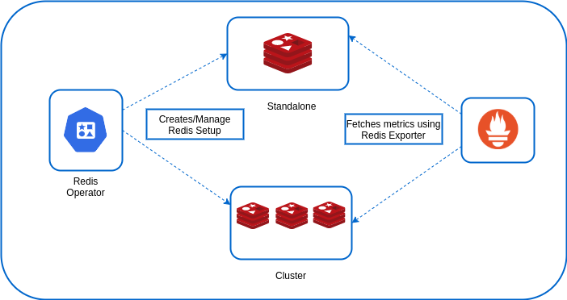

# Speculator: Redis Operator

I am a golang based redis operator which will create/manage Redis standalone/cluster mode setup on top of the Kubernetes.

### Getting Started Architecture

  

The redis-operator will run in a separate namespace and it will be responsible for the Redis standalone/Cluster mode

## To Do
- Add slave statefulsets in operator
- Add services for slave statefulsets in operator
