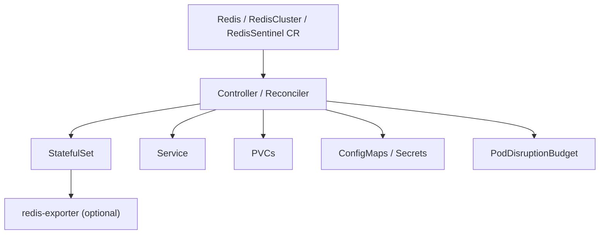

This page provides a high-level view of how Redis Operator turns a CR into Kubernetes resources.

## Reconciliation flow

- You apply or update a Redis custom resource.
- The controller reconciles desired state into Kubernetes primitives.
- StatefulSets manage Redis pods and their storage.
- Services and PDBs provide networking and disruption protection.
- ConfigMaps and Secrets provide configuration and credentials.
