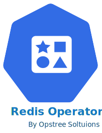
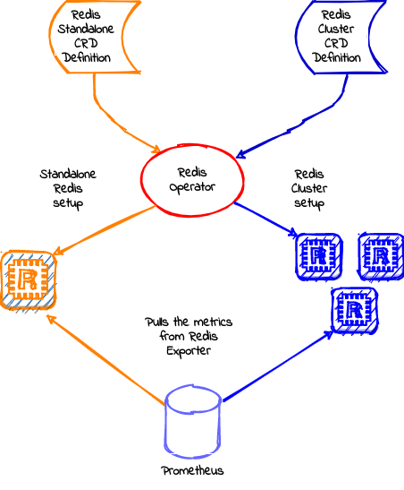

.. _architecture:

##############
Redis Operator
##############

A Golang based redis operator that will make/oversee Redis standalone/cluster mode setup on top of the Kubernetes. It can create a redis cluster setup with best practices on Cloud as well as the Bare-metal environment. Also, it provides an in-built monitoring capability using redis-exporter.

Architecture
============

Purpose
===========

The purpose of creating this operator was to provide easy and production-grade setup of Redis on Kubernetes. It doesn't care if you have a plain on-prem Kubernetes or cloud-based.

Supported Features
==================

Here the features which are supported by this operator:-

- Redis cluster/standalone mode setup
- Inbuilt monitoring with Prometheus exporter
- Dynamic storage provisioning with PVC template
- Resources restrictions with k8s requests and limits
- Password/Password-less setup
- Node selector and affinity
- Priority class to manage setup priority
- SecurityContext to manipulate kernel parameters

