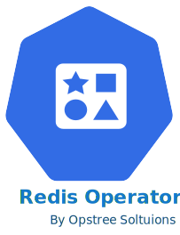
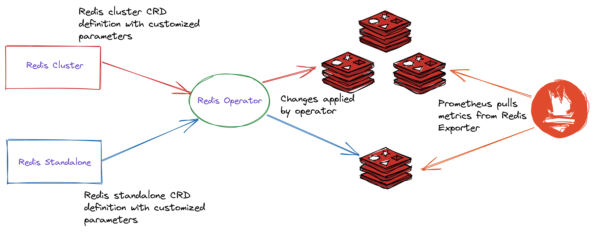

# Introduction

    

A Golang based redis operator that will make/oversee Redis standalone/cluster mode setup on top of the Kubernetes. It can create a redis cluster setup with best practices on Cloud as well as the Bare-metal environment. Also, it provides an in-built monitoring capability using redis-exporter.

Documentation is available here:- https://ot-container-kit.github.io/redis-operator/

The type of Redis setup which is currently supported:-

- Redis Cluster (in-built leader follower with sharding and replication mode)
- Redis standalone setup

## Supported Features

Here the features which are supported by this operator:-

- Redis cluster(leader-follower in sharding and replication mode) and standalone setup
- Inbuilt monitoring support using the Redis Exporter to give detailed insights
- Dynamic storage provisioning using the PVC template
- Performance tuned best practices in redis configuration
- Password and password-less support for cluster and standalone setup
- A few Kubernetes based object supported like:-
    - NodeSelector
    - Affinity
    - Resource and Limits
    - Tolerations
    - SecurityContext
    - Storage

## Architecture

    

