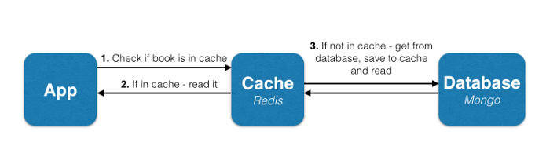
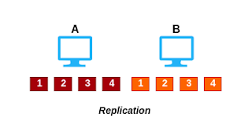
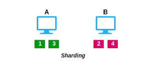
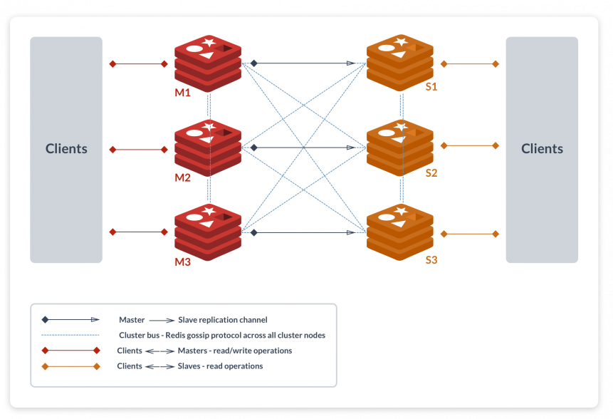

# Redis Overview

Redis is a popular and opensource in-memory database that supports multiple data structures like strings, hashes, lists, and sets. But similar to other tools, we can scale standalone redis to a particular extent and not beyond that. That’s why we have a cluster mode setup in which we can scale Redis nodes horizontally and then distribute data among those nodes.

## Redis as a Database

Sometimes getting data from disks can be time-consuming. In order to increase the performance, we can put the requests those either need to be served first or rapidly in Redis memory and then the Redis service there will keep rest of the data in the main database. So the whole architecture will look like this:-

## Redis Leader-Follower Replication

Beginning with the explanation about Redis Leader-Follower. In this phenomenon, Redis can replicate data to any number of nodes. ie. it lets the follower have the exact copy of their leader. This helps in performance optimizations.

## Redis Cluster

A Redis cluster is simply a [data sharding strategy](https://www.digitalocean.com/community/tutorials/understanding-database-sharding). It automatically partitions data across multiple Redis nodes. It is an advanced feature of Redis which achieves distributed storage and prevents a single point of failure.

## Replication vs Sharding

Replication is also known as mirroring of data. In replication, all the data get copied from the leader node to the follower node.
Sharding is also known as partitioning. It splits up the data by the key to multiple nodes.

    

As shown in the above figure, all keys 1, 2, 3, 4 are getting stored on both machine A and B.

    

In sharding, the keys are getting distributed across both machine A and B. That is, the machine A will hold the 1, 3 key and machine B will hold 2, 4 key.

## Challenges with Kubernetes

Kubernetes has made the deployment of stateful application quite easy by StatefulSets. By using StatefulSets, we can easily deploy and scale any kind of stateful applications like Kafka, Zookeeper, etc.
But in the case of redis, the setup is not straightforward, there are some additional things which needs to be taken care:-

- We have to use the headless service of Redis because it’s a TCP based service and normal service is HTTP(Layer 7) based Loadbalancer. So in case of headless service, no ClusterIP will be used and we have to rely on Pod IP.
- Redis doesn’t use DNS to form clusters instead of that it uses IP. So we cannot use the internal DNS name of headless service, instead of that, we have to use Pod IP to form a Redis cluster.
- In Kubernetes, Pod IP is dynamic and it can change after the pod restart, so in case of the restart the cluster will be malformed and the restarted pod will act as a lost node.
