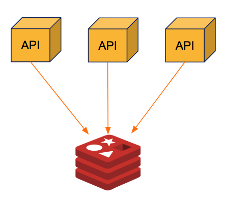
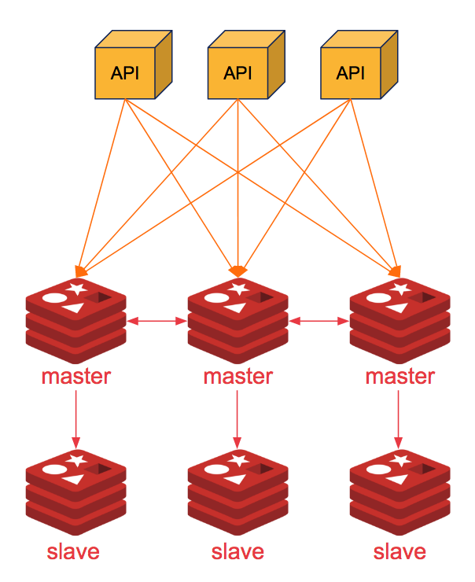

# Redis Setup

This redis operator supports below deployment strategies for redis:-

- Redis in-build master slave with sharding and replication mode
- Redis standalone setup

Here we will see how we can leverage these strategies.

## Redis Standalone

<div align="center">
    
</div>

In redis standalone mode, we deploy redis as a single Stateful pod which means ease of setup, no complexity, no high availability, and no resilience.

```shell
$ helm upgrade redis ot-helm/redis-setup \
    --set setupMode="standalone" \
    --install --namespace redis-operator
...
Release "redis" does not exist. Installing it now.
NAME: redis
LAST DEPLOYED: Sun May  2 15:59:48 2021
NAMESPACE: redis-operator
STATUS: deployed
REVISION: 1
TEST SUITE: None
```

Verify the standalone redis setup by `kubectl` command line.

```shell
$ kubectl get pods -n redis-operator
...
NAME                              READY   STATUS    RESTARTS   AGE
redis-operator-74b6cbf5c5-td8t7   1/1     Running   0          81m
redis-standalone-0                2/2     Running   0          56s
```

## Redis Cluster

<div align="center">
    
</div>

A Redis cluster is simply a [data sharding strategy](https://www.digitalocean.com/community/tutorials/understanding-database-sharding). It automatically partitions data across multiple Redis nodes. It is an advanced feature of Redis which achieves distributed storage and prevents a single point of failure.

For redis cluster setup we can use same helm command but with different parameters.

```shell
$ helm upgrade redis-cluster ot-helm/redis-setup \
    --set setupMode="cluster" --set cluster.size=3 \
    --install --namespace redis-operator
...
Release "redis-cluster" does not exist. Installing it now.
NAME: redis-cluster
LAST DEPLOYED: Sun May  2 16:11:38 2021
NAMESPACE: redis-operator
STATUS: deployed
REVISION: 1
TEST SUITE: None
```

Verify the cluster by checking the pod status of master and slave pods.

```shell
$ kubectl get pods -n redis-operator
...
NAME                              READY   STATUS    RESTARTS   AGE
redis-operator-74b6cbf5c5-td8t7   1/1     Running   1          90m
redis-slave-0                     2/2     Running   0          75s
redis-master-0                    2/2     Running   0          76s
redis-slave-1                     2/2     Running   0          54s
redis-master-1                    2/2     Running   0          49s
redis-slave-2                     2/2     Running   0          35s
redis-master-2                    2/2     Running   0          26s
```

If all the pods are in the running state of master and slave Statefulsets, then we can check the health of the redis cluster by using `redis-cli`

```shell
$ kubectl exec -it redis-master-0 -n redis-operator -- redis-cli -a Opstree@1234 cluster nodes
...
Defaulting container name to redis-master.
Use 'kubectl describe pod/redis-master-0 -n redis-operator' to see all of the containers in this pod.
Warning: Using a password with '-a' or '-u' option on the command line interface may not be safe.
528438a759cee4528c3071d17d75b27b0818555d 10.42.0.219:6379@16379 myself,master - 0 1619952294000 1 connected 0-5460
8ec7812903b7e046bec2f2a7bce4a9ccadfa4188 10.42.0.221:6379@16379 slave d0ff3892d2eba0b2707199cb5df57adbba214bcd 0 1619952297241 3 connected
60f932272322bafbd8c3e16328d26af676aeb8d6 10.42.0.220:6379@16379 slave 6e80da4902802ebffa94cbac9b7d98e9fd74121f 0 1619952297000 2 connected
6e80da4902802ebffa94cbac9b7d98e9fd74121f 10.42.2.178:6379@16379 master - 0 1619952297000 2 connected 5461-10922
d0ff3892d2eba0b2707199cb5df57adbba214bcd 10.42.1.178:6379@16379 master - 0 1619952298245 3 connected 10923-16383
c2b74bd2a360068db01dfc8f00b8d0b012e21215 10.42.1.177:6379@16379 slave 528438a759cee4528c3071d17d75b27b0818555d 0 1619952297000 1 connected
```